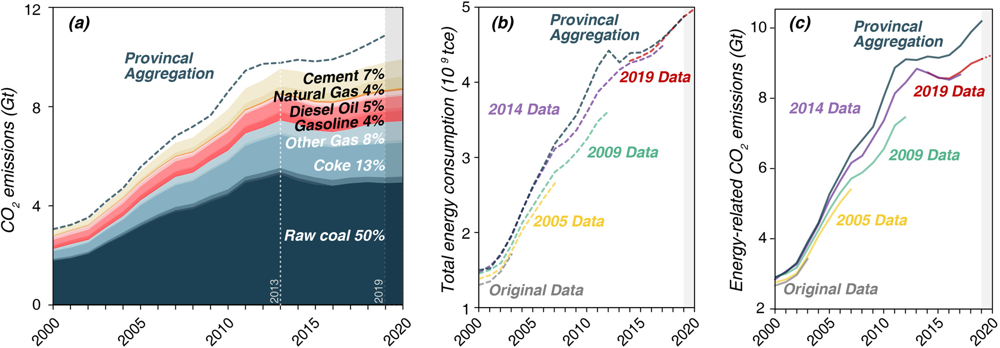
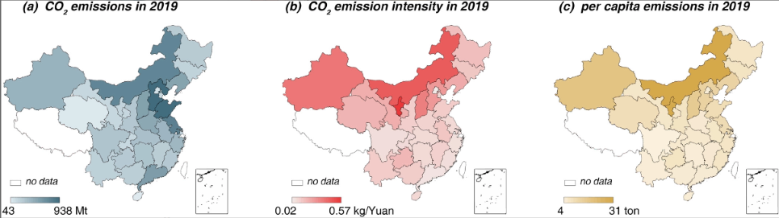
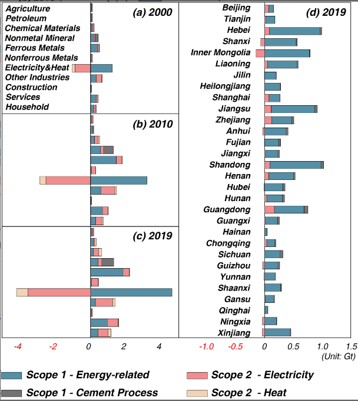

## Abstract

The most recent energy revision led to an increase in reported national CO2 emissions by an average of 0.3% from 2014 to 2017. The results show that data revisions raised China's carbon intensity mitigation baseline (in 2005) by 5.1%–10.8% and thus made it more challenging to fulfill the mitigation pledges. However, the 2020 carbon intensity mitigation target was achieved ahead of schedule in 2018. A preliminary estimate of China's national emissions for 2020 shows that the COVID-19 pandemic and lock down was not able to offset China's annual increase in CO2 emissions. These emissions inventories provide an improved evidence base for China's policies toward net-zero emissions.

Key points in parts of Results and Discussion

1. More than 50 % of China's carbon emission come from Raw coal combustion.
2.  The Growth rate of carbon emission was still increasing despite COVID lock downs, although rising trends were mitigated

(Figure. 1)

3. Northern Provinces in China generally produce more carbon, tend to have higher intensity, and have higher per capita emissions

（Figure. 2）

4. Inconsistency between national data and provincial aggregated data was mainly due to intraregional electric and heat transport statistic errors.  

## Conclusion

China is still in the process of industrialization and urbanization, and therefore facing a series of challenges on the road toward net-zero emissions. The first challenge for policymakers is to promote a systemic reform of its energy statistics. Suggestions for the reform of the energy statistics system, such as collecting data through more on-site surveys and using remote sensing technologies have also been discussed. On the other hand, de-carbonizing the energy mix could be carried out by reducing the dependence on coal consumption, supporting renewable energy technologies through subsidies and carbon pricing, and accelerating the construction of smart energy systems to maximize energy utilization. Overall, China's de-carbonization of the energy mix cannot be accomplished overnight, it will inevitably undergo a long-term process.

Access for the Original Article: [DOI-10.1029/2021EF002241](https://doi.org/10.1029/2021EF002241)