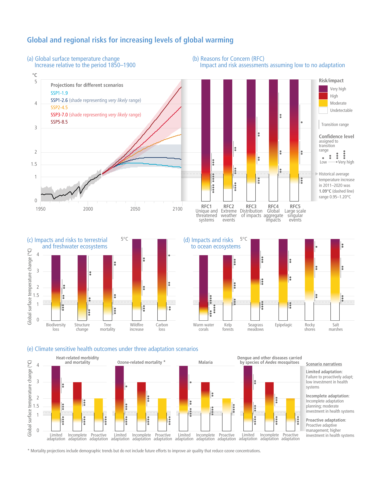
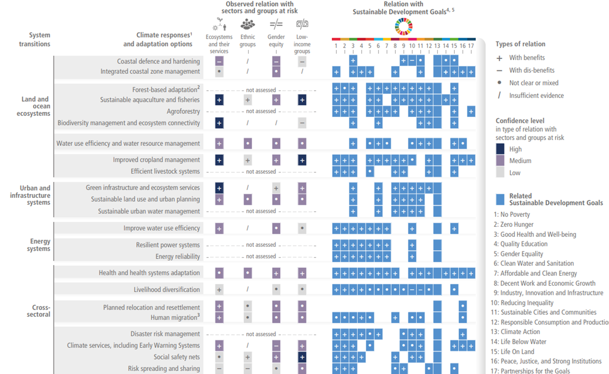

Observed Impacts from Climate Change

Human-induced climate change has caused the rise in weather and climate extremes which has led to some irreversible impacts as natural and human systems are pushed beyond their ability to adapt as shown below.

Vulnerability and Exposure of Ecosystems and People

Vulnerability of ecosystems and people to climate change differs substantially among and within regions, due to intersecting socioeconomic development, unsustainable ocean and land use, inequity, marginalization, historical and ongoing patterns of inequity such as colonialism, and governance. Approximately 3.3 to 3.6 billion people live in contexts that are highly vulnerable to climate change.

Risks in Near term and Mid to Long term 

Near term risks of global warming include increases in climate hazards accompanied with loss of ecosystems and biodiversity. In the Mid to Long-term Risks include extinction of species, increase of water-related hazards, food shortage, ill-health and premature death.

Complex, Compound and Cascading Risks

Climate change impacts and risks are becoming increasingly complex and more difficult to manage. Multiple climate hazards will occur simultaneously, and multiple climatic and non-climatic risks will interact, resulting risks compounding and cascading across sectors and regions. If global warming transiently exceeds 1.5°C in the coming decades, depending on the magnitude and duration of overshoot, some impacts will cause release of additional greenhouse gases and some will be irreversible, even if global warming is reduced.

Current Adaptation and its Benefits

Progress in adaptation planning and implementation has been observed across all sectors and regions, generating multiple benefits. However, adaptation progress is unevenly distributed with observed adaptation gaps. Many initiatives prioritize immediate and near-term climate risk reduction which reduces the opportunity for transformational adaptation.

Future Adaptation Options and their Feasibility

The feasibility of implementing adaptation options in the near-term differs across sectors and regions. The effectiveness of adaptation to reduce climate risk is documented for specific contexts, sectors and regions and will decrease with increasing warming. Integrated, multi-sectoral solutions that address social inequities, differentiate responses based on climate risk and cut across systems, increase the feasibility and effectiveness of adaptation in multiple sectors 

Limits to Adaptation

Soft limits to some human adaptation have been reached, but can be overcome by addressing a range of constraints,
primarily financial, governance, institutional and policy constraints. Hard limits to adaptation have been reached in some ecosystems. With increasing global warming, losses and damages will increase and additional human and natural systems will reach adaptation limits. 

Avoiding Mal-adaptation

Maladaptive responses to climate change can create lock-ins of vulnerability, exposure and risks that are difficult and expensive to change and exacerbate existing inequalities. Mal-adaptation can be avoided by flexible, multi-sectoral, inclusive and long-term planning and implementation of adaptation actions with benefits to many sectors and systems.

Enabling Conditions
Enabling conditions are key for implementing, accelerating and sustaining adaptation in human systems and ecosystems. These include political commitment and follow-through, institutional frameworks, policies and instruments with clear goals and priorities, enhanced knowledge on impacts and solutions, mobilization of and access to adequate financial resources, monitoring and evaluation, and inclusive governance processes.

Conditions for Climate Resilient Development
Evidence of observed impacts, projected risks, levels and trends in vulnerability, and adaptation limits, demonstrate that
worldwide climate resilient development action is more urgent than previously assessed in AR5. Comprehensive, effective,
and innovative responses can harness synergies and reduce trade-offs between adaptation and mitigation to advance
sustainable development.

Enabling Climate Resilient Development

Governments and civil society must combat climate change together by prioritizing risk reduction by making sure every sector is covered and traditionally marginalized groups such as women, youth, and ethnic minorities are not neglected. These Partnerships are most supported by enabling political leadership, institutions, resources, including finance, as well as climate services, information and decision support tools.

Climate Resilient Development for Natural and Human Systems

Interactions between changing urban form, exposure and vulnerability can create climate change-induced risks and losses
for cities and settlements. However,  inclusive planning and investment in everyday decision-making about urban infrastructure, including social, ecological and grey/physical infrastructures, can significantly increase the adaptive capacity of urban and rural settlements. Equitable outcomes contributes to multiple benefits for health and well-being and ecosystem services. 

Climate Resilient and Biodiversity

Safeguarding biodiversity and ecosystems is fundamental to climate resilient development, in light of the threats climate
change poses to them and their roles in adaptation and mitigation. Recent analyses, drawing on a range of lines of evidence, suggest that maintaining the resilience of biodiversity and ecosystem services at a global scale depends on effective and equitable conservation of approximately 30% to 50% of Earth’s land, freshwater and ocean areas, including currently near-natural ecosystems.

Achieving Climate Resilient Development
Past and current development trends (past emissions, development and climate change) have not advanced global climate resilient development. Climate resilient development prospects are increasingly limited if current greenhouse gas emissions do not rapidly decline, especially if 1.5°C global warming is exceeded in the near-term. These prospects are constrained by past development, emissions and climate change, and enabled by inclusive governance, adequate and appropriate human and technological resources, information, capacities and finance.

